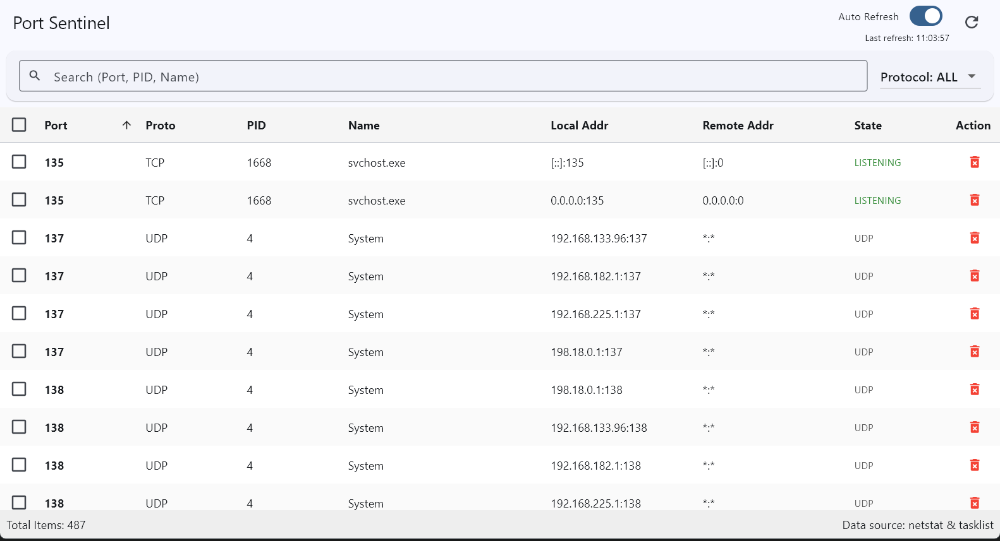

# Port Sentinel

[English](README.md) | [中文](README_zh.md)

Flutter Windows Desktop application for monitoring ports and managing processes.

Introduction Article: [Port Sentinel Release](https://sanjeev.top/en/posts/2026/01/15-port-sentinel-release)

> 🎉 Featured in Ruan YiFeng's [Technology Enthusiasts Weekly (Issue 382)](https://github.com/ruanyf/weekly/blob/master/docs/issue-382.md?plain=1#L187)

## Features

- **Monitor Ports**: View all TCP/UDP ports currently in use.
- **Process Info**: See which process (PID and Name) is using a port.
- **Search & Filter**:
  - Search by Port, PID, or Process Name.
  - Filter by Protocol (TCP/UDP).
- **Kill Process**: Terminate conflicting processes directly from the app.
  - Includes safety confirmation dialog.
- **Auto Refresh**: Optional automatic data update.

## Screenshot



## Requirements

- Windows 10 or later.
- Administrator privileges recommended (for killing system processes or seeing all details).

## Development

1. **Install Flutter**: Ensure Flutter SDK is installed and configured.
2. **Run**:
   ```bash
   flutter pub get
   flutter run -d windows
   ```

## Note on Permissions

If you encounter "Access Denied" when trying to kill a process, please run the application as Administrator.

## License

[MIT](LICENSE)
